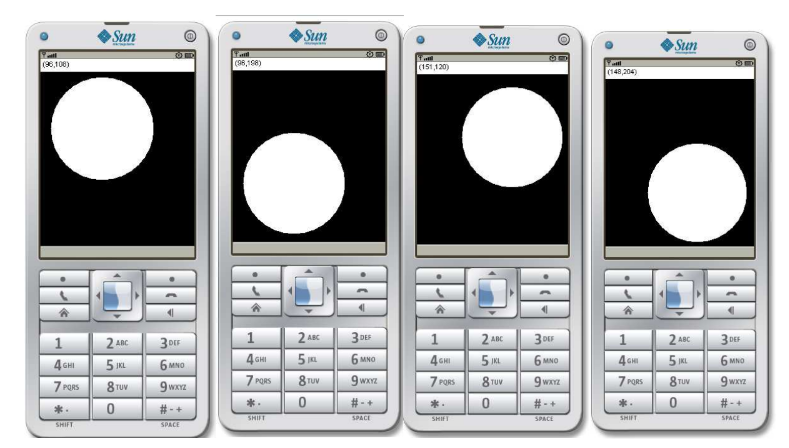

# Bouncing Ball Game Application

## Introduction

The Bouncing Ball Game is a simple mobile game developed using the Sun Java (TM) Wireless Toolkit 2.5.2. In this game, a ball bounces off the walls of the screen, changing direction each time it hits a boundary. The game uses the `GameCanvas` class to manage the ball's movement and collision detection. This document provides an overview of the project, including setup instructions, code details, and screenshots of the application in action.



## Requirements

-   Sun Java (TM) Wireless Toolkit 2.5.2
-   Notepad or any text editor
-   Microsoft Word (for documentation and screenshots)

## Setup Instructions

1. **Install Sun Java (TM) Wireless Toolkit 2.5.2**:
   Download and install the toolkit from the official website.

2. **Create a New Project**:

    - Open the Wireless Toolkit.
    - Create a new project named `BouncingBall`.
    - Set up the project directory.

3. **Develop the Game**:

    - Use Notepad to write the Java code for the game.
    - Save the main Java file as `BouncingBall.java`.

4. **Compile and Run the Project**:
    - Use the toolkit to compile the project.
    - Run the project on the emulator provided by the toolkit.

## Code Overview

### `BouncingBall.java`

```java
import javax.microedition.midlet.*;
import javax.microedition.lcdui.*;

public class BouncingBall extends MIDlet implements CommandListener {
    private Display display;
    private BallCanvas canvas;
    private Command exitCommand;

    public BouncingBall() {
        display = Display.getDisplay(this);
        canvas = new BallCanvas();
    }

    public void startApp() {
        display.setCurrent(canvas);
    }

    public void pauseApp() {
    }

    public void destroyApp(boolean unconditional) {
    }

    public void commandAction(Command c, Displayable d) {
        if (c == exitCommand) {
            destroyApp(false);
            notifyDestroyed();
        }
    }

    class BallCanvas extends Canvas implements Runnable {
        private int xMin = 0;
        private int xMax;
        private int yMin = 0;
        private int yMax;
        private int ballRadius = 80;
        private int ballX = ballRadius + 20;
        private int ballY = ballRadius + 20;
        private int ballSpeedX = 1;
        private int ballSpeedY = 1;
        private int topBarHeight = 20;
        private Thread thread;

        public BallCanvas() {
            xMax = getWidth() - 1;
            yMax = getHeight() - 1;
            thread = new Thread(this);
            thread.start();
        }

        public void paint(Graphics g) {
            g.setColor(0, 0, 0);
            g.fillRect(0, 0, getWidth(), getHeight());

            g.setColor(255, 255, 255);
            g.fillRect(0, 0, getWidth(), topBarHeight);

            g.setColor(255, 255, 255);
            g.fillArc(ballX - ballRadius, ballY - ballRadius, 2 * ballRadius, 2 * ballRadius, 0, 360);

            g.setColor(0, 0, 0);
            g.drawString("(" + ballX + "," + ballY + ")", 10, 1, Graphics.TOP | Graphics.LEFT);
        }

        private void update() {
            ballX += ballSpeedX;
            ballY += ballSpeedY;

            if (ballY - ballRadius < topBarHeight) {
                ballSpeedY = -ballSpeedY;
                ballY = topBarHeight + ballRadius;
            }

            if (ballX + ballRadius > xMax) {
                ballSpeedX = -ballSpeedX;
                ballX = xMax - ballRadius;
            } else if (ballX - ballRadius < xMin) {
                ballSpeedX = -ballSpeedX;
                ballX = xMin + ballRadius;
            }
            if (ballY + ballRadius > yMax) {
                ballSpeedY = -ballSpeedY;
                ballY = yMax - ballRadius;
            } else if (ballY - ballRadius < yMin) {
                ballSpeedY = -ballSpeedY;
                ballY = yMin + ballRadius;
            }
        }

        public void run() {
            while (true) {
                update();
                repaint();
                try {
                    Thread.sleep(50);
                } catch (InterruptedException e) {
                }
            }
        }
    }
}
```
